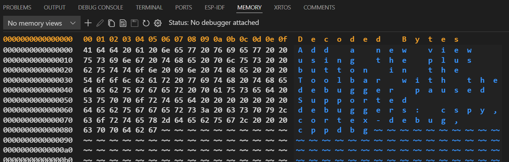

# Using Foam

Foam is a collection VS Code extensions and recipes that power up the editor into a full-blown note taking system. This folder contains user documentation describing how to get started using Foam, what its main features are, and strategies for getting the most out of Foam. The full docs are included in the `foam-template` repo that most users start from.

> See also [[frequently-asked-questions]].

这是一个脚注 [^1]

双向链接测试: [[C语言回调函数#简单示例]]

## Getting Started

- [[get-started-with-vscode]]
- [[recommended-extensions]]
- [[creating-new-notes]]
- [[write-notes-in-foam]]
- [[sync-notes-with-source-control]]
- [[keyboard-shortcuts]]

## Features

- [[wikilinks]]
- [[tags]]
- [[backlinking]]
- [[daily-notes]]
- [[including-notes]]
- [[spell-checking]]
- [[graph-visualization]]
- [[note-properties]]
- [[note-templates]]
- [[paste-images-from-clipboard]]
- [[custom-markdown-preview-styles]]
- [[link-reference-definitions]]
- [[custom-snippets]]

## Recipes

[[recipes]] is a collection of user-contributed patterns that describe different ways you could utilize Foam or integrate it with other tools.

## Publishing

You can publish your Foam notes for consumption in different formats.
Examples: [[publish-to-github-pages]], [[generate-gatsby-site]], [[publish-to-vercel]]

See [[publishing]] for more details.

## Tools

- [[cli]]
- [[workspace-janitor]]
- [[orphans]]
- [[foam-logging-in-vscode]]


## Mkdocs-Material

It's good to use mkdocs-material!

## Todo

You can create todos in Foam.

- [x] 修复图片无法访问问题, 目录层级问题，/docs
- [x] 选择更美观的主题，pip 安装其他主题
- [x] 查看 mkdocs 和 mkdocs-material 文档
- [x] 修复公式无法显示问题
- [ ] 表格美化,默认样式，无法美化
- [ ] 代码块美化，默认样式，无法美化
- [ ] Alt + C 切换待办列表状态，增加gif演示
- [x] 增加代码块复制按钮
- [x] 深色/切色模式切换
- [x] This is an example of a todo list item that's complete
- [ ] This one is not completed yet


[通过github/gitee page生成网页，分享你的foam/obsidian/markdown笔记](https://github.com/Jackiexiao/foam-mkdocs-template/blob/master/README-zh.md)

## 本地部署
```sh
pip install -U -r requirements.txt
mkdocs serve 
```

## Code Snippet

```c title="demo.c"
/******************************************************
 * @brief   最简单的C函数
 * @note    没有需要注意的
 ******************************************************/
for (size_t i = 0; i < 5; i++)
{
    printf("Hello World\n");   
}
```

```sh
echo "Hello World"
```

Inline math: $x^2$

Math block:

$$
\displaystyle
\left( \sum_{k=1}^n a_k b_k \right)^2
\leq
\left( \sum_{k=1}^n a_k^2 \right)
\left( \sum_{k=1}^n b_k^2 \right)
$$



## Git Commit常用Emoji

| Emoji |      描述      |           Description            |
| :---: | :------------: | :------------------------------: |
|   🎉   |   创建新工程   |          Beginaproject           |
|   ✨   |     新功能     |       Introducenewfeatures       |
|   🐛   |    修复Bug     |             Fixabug              |
|   🔀   |    合并分支    |          Mergebranches           |
|   ⚡️   |    性能提升    |        Improveperformance        |
|   ✅   |    通过测试    |     Add,update,orpasstests.      |
|   ♻️   |      重构      |           Refactorcode           |
|   🔥   | 删除代码或文件 |        Removecodeorfiles         |
|   📝   | 更新文档或协议 |    Addorupdatedocumentation.     |
|   🔖   |    发布版本    |       Release/Versiontags        |
|   💡   |    增加注释    | Addorupdatecommentsinsourcecode. |

<details>

<summary>Tips for collapsed sections</summary>

You can add an image or a code block, too.

```ruby
puts "Hello World"~~~~
```

</details>

!!! abstract
    This is a abstract test.

!!! info
    This is a info test.

!!! question
    This is a question test.

!!! warning
    This is a warning test.

!!! failure
    This is a failure test.

!!! danger
    This is a danger test.

!!! bug
    This is a bug test.

!!! example
    This is a example test.


??? success

    Lorem ipsum dolor sit amet, consectetur adipiscing elit. Nulla et euismod
    nulla. Curabitur feugiat, tortor non consequat finibus, justo purus auctor
    massa, nec semper lorem quam in massa.

### 27th
??? abstract "What's your day today"
    Not a bad day.

[^1]: 脚注 1
