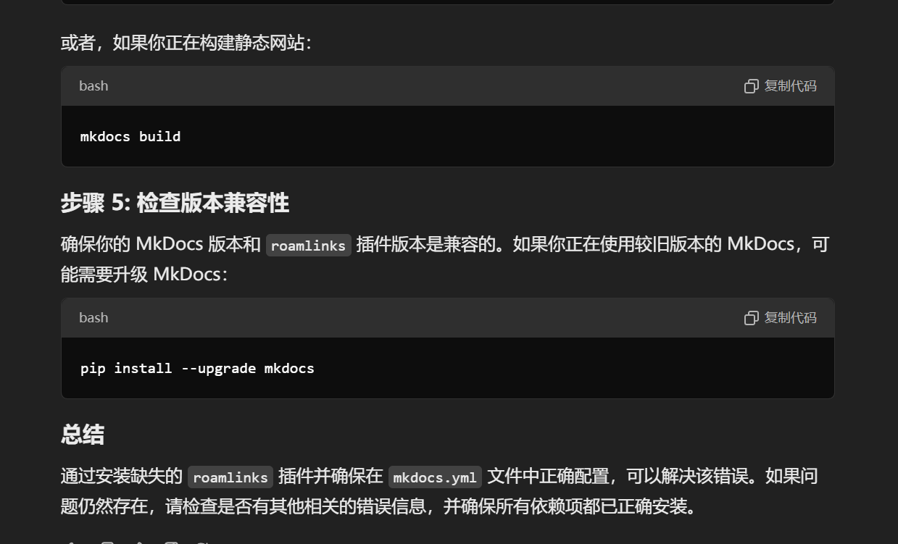

# 待办列表

You can create todos in Foam.

- [x] This is an example of a todo list item that's complete
- [ ] This one is not completed yet
- [ ] You can mark it completed by pressing `Option`+`C` (or `Alt`+`C`) when your cursor is on this line
  - [ ] You can also select multiple lines and mark them all at once!
- [ ] Trying the Backlinking [[New Idea]]

